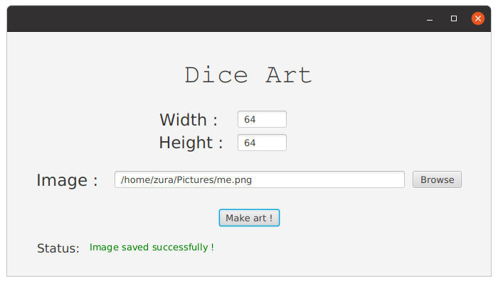

# dice-art
Converting images to dice art in Java. 
I got the idea from a video similar to this one : https://youtu.be/35Xgx6IfG5I 

# Usage
Warning: **.jar** file was created using **openjdk version "16.0.1"**. Check **JRE** version or recompile if you encounter problems.
  
1- Download **dice-art.jar** from https://github.com/zurakin/dice-art/releases/download/v1.0/dice-art.jar

2- Download **javafx-sdk 16** from https://openjfx.io/

3- Download **JRE** from https://www.oracle.com/java/technologies/javase/jdk11-archive-downloads.html

4- Run `java --module-path {path_to_javafx-sdk}/lib --add-modules javafx.controls,javafx.fxml -jar {jar_location}/dice-art.jar`

# Instructions
1- Choose number of dice used in width and height

2- Load image

3- **Make Art !**

# screenshots

